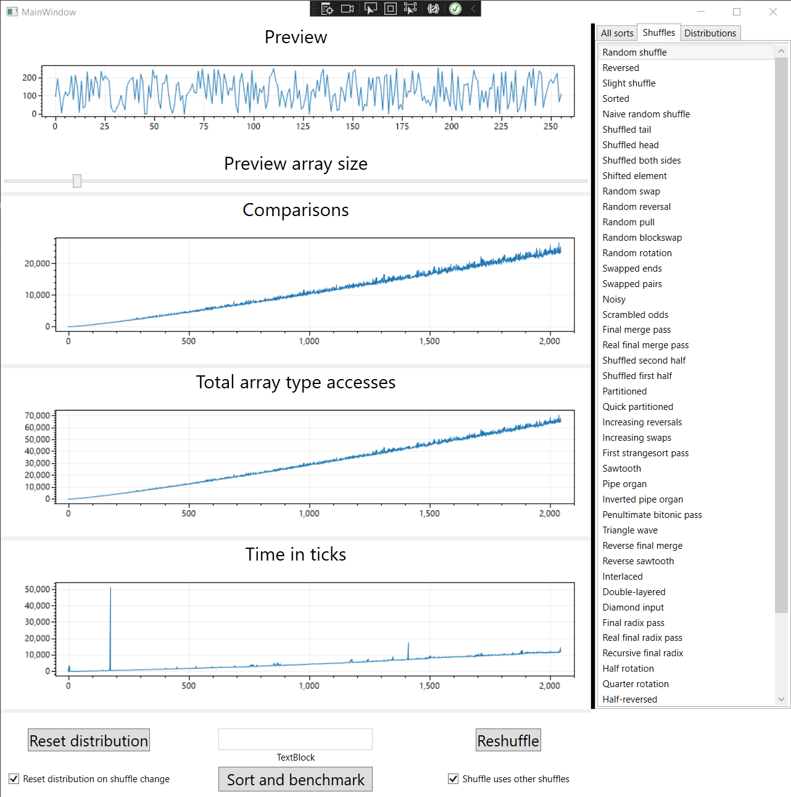

# AlgoBenchmark
 WPF/XAML program for benchmarking the performance, comparisons, and data type accesses of sorting algorithms on all input sizes of a certain range

The benchmarks are shown in graphs using ScottPlot's signal plot, with the X axis being the array sizes run, and the Y axis being the number of the respective metric occuring per array size. Lower scores are better, because it's the number of comparisons, type accesses, and elapsed time in ticks.

Note that all the algorithms used are generic, meaning not modified to facilitate variables, methods, properties, etc, of the program just to run or chart/visualize them. All that's special is the data type (ArrayInt instead of int) and the IComparer used. For example:
```
internal class ArraySort : ISorter
    {
        public string Title => "Array.Sort()";

        public string Message => "";

        public string Category => "Quick sorts";

        public Complexity Time => Complexity.GOOD;

        public void RunSort<T>(T[] array, int end, double parameter, IComparer<T> cmp)
        {
            Array.Sort(array, 0, end, comparer: cmp);
        }
    }
```



`Sort\.Write\((.*?),(.*?),(.*?)\)`
# How to convert from ArrayV to generic
Press CTRL F and enable regular expressions
- `Writes.write(array, at, equals, delay, mark, auxwrite)`: enter `Writes\.write\((.*?),(.*?),(.*?),.*?\)` in the "find" dialog, and enter `$1[$2] = $3` in the "replace" dialog.
- `Writes.createExternalArray(length)`: replace with `new T[length]` or `new ArrayInt[length]`
- `Reads.compareValues`: replace with `cmp.Compare`
- `Reads.compareIndices(array, a, b, delay, mark)`: it just means `Reads.compareValues(array[a], array[b])`. In other words, turn on regular expressions, find `Reads\.compareIndices\((.*?),(.*?),(.*?),.*?\)`, and replace with `cmp.Compare($1[$2], $1[$3])`.
- ArrayInt is just int but with access monitoring. Replace int[] with T[] unless the arrays have non-generic operations such as arithmetic, bit operations, and math (as in array[i] + 1, or aux[array[i]]). Otherwise, either keep them as int[] or change them to ArrayInt[] for more accurate statistics.
- `Writes.swap(array, a, b, delay, mark, auxwrite)`: With regular expressions, find `Writes\.swap\((.*?),(.*?),(.*?),.*?\)` and replace with `Sort.Swap($1, $2, $3)`